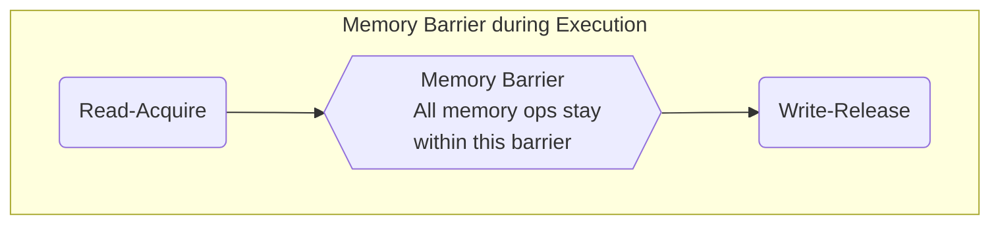

# Summary of talks on important C++ Concepts

## TODO - Interesting talks

1. [Deprecating volatile - JF Bastien - CppCon 2019](https://www.youtube.com/watch?v=KJW_DLaVXIY)

------

## C++ Memory Model: from C++11 to C++23

[Alex Dathskovsky](https://www.linkedin.com/in/alexdathskovsky/), Talk at CppCon 2023

References:
- [1] Talk at [CppCon-2023](https://www.youtube.com/watch?v=SVEYNEWZLo4)
- [2] ACCU Magazine,
      [Use SIMD: Save The Planet](https://accu.org/journals/overload/31/178/overload178.pdf),
      Overload 178 tech mag, 12/2023

### Compiler Optimizations:

- Constant value factorization [ E.g. get(n) ]
- Remove redundant multiplications (Op is expensive)
- Loop Unrolling
- Dead code elimination

- Branch Prediction: CPUs may perform this using few bits per branch,
  use branch history, to pre-compute instructions optimistically.
    - If prediction is "wrong", leads to CPU cache-flush - **increased latency**

- **Newer Vectorized CPUs**: Intel AVX; Multiple registers (512 bytes)

- **Single-Instruction Multiple Data** (SIMD) instructions:
    - Available in modern h/w: Need to leverage Parallel computing technology
    - Allows processors to perform same data op on multiple data elements concurrently
    - In a single clock cycle
    - E.g., w/256 SIMD-registers, can process in a single-clock cycle concurrently:
        - 8 32-bit floating-point ops
        - 16 16-bit int (short, uint16_t) ops
    - E.g., On x86 have SSE2, AVX2, AVX512 SIMD-instruction sets

    - OO C++ code, data structures' layout may not be memory-friendly for SIMD execution
        - Need predictable memory accesses to data to gain from vectorized execution
        - Refactor structures to enable SIMD, and to avoid frequent instruction-cache
          invalidations
        - Arrange sub-arrays / sub-vectors that can be SIMD-exec'ed contiguous
          (e.g., objects of the same type, of the same size.)

### Guidelines to leverage SIMD-benefits

- Vectorized loops assume calculations are independent across iterations

- May need to refactor performance-critical regions of code using data-oriented
      design principles to leverage SIMD-execution

- Effective auto-vectorization requires:
    - Loops with known sizes
    - Simple exit conditions
    - Straight-line, Branchless loop bodies
    - No loop-dependencies (Loop's body uses a value computed in a previous iteration)

    - Consider helping compiler with hints: (enables aggressive parallelization!)
        - Use of [RESTRICT](https://en.wikipedia.org/wiki/Restrict) keyword for
          pointers, telling the compiler that no other pointer will access the
          object for the life-time of this pointer.
        - Use #pragmas with loops suggesting how-to process the loop.

### CPU Optimizations

Von-Neumann Process Architecture:

- Pipelined instruction execution with stages. E.g, 4-stages of execution pipeline
    - Fetch - Instruction from memeory into processor's pipe
    - Decode - Understand "decode" instruction
    - Execute - Send instruction to execution unit (e.g. ALU, FPU ...)
    - Write-back - Results of execution to memory: Can STALL for a long-time,
      leading to **increased latency**

- Dynamic Scheduling using branch prediction: **Out-of-Order** execution
    - Instr is pre-fetched, dispatched to instruction queue
    - Instr waits in queue till all its operands are available
    - Instr can early-exit queue, out-of-order, if all its operands are available
    - Instr 'completion' is written to output only if all older instructions have
      completed; i.e. maintain commit-order sequencing

    - **OofOrder** execution really important for modern CPUs -- increased performance

- Multi-Level Memory caches: Capacity inversely proportional to access time
    - Disk (1ms) - HDD, SSDs, 100s GiB to TiBs ...
    - DRAM (100ns) - ~xGibs; e.g., 2-4-256-512 GiB
    - L2-cache (5ns) - ~few MiBs, 8 MiB
    - L1-cache (1-2ns) - ~few KiBs, 64 - 128 KiB
    - CPU (0.25ns) - ~few B, < 512 bytes; Registers, Data / Instruction caches

### Multi-Threading and Reordering

- Sequential Consistency is the goal: Result of concurrent execution is "as-if" all
  the threads run sequentially.

- SC-DRF - Data Race Free - Needs specific synchronization mechanisms which create
  a "happens before" relation between code running on diff threads on diff processors

- VOLATILE keyword - **Not a synchronization tool**
    - Does not affect multi-threading. Is NOT an atomic value. Does not add barriers.
    - Just tells the compiler: Do not optimize the memory reads & writes order
    - **BUT** - CPU can still reorder instructions at runtime
        - E.g., two VOLATILEs in one thread's code block could be reordered at run-time

    - Classical usage of VOLATILE: int y = 1; VOLATILE int * x = &y; (x is declared as a VOLATILE pointer to int-y)

    - Examples of abuses of VOLATILE keywords:
        - some_func(int VOLATILE n);
        - int VOLATILE some_func();
        -
    - So, we still need separate synchronization mechanisms.

- Compiler Code Barriers - Do -NOT- reorder things before / after barrier

    - Locks and ATOMICs are sync tools / memory barriers

**Understanding Memory barriers**: [~28m]

- **Acquire Semantics**: Property that applies to READ-from-[shared]-memory ops, for
  both plain READs and Read-Modify-Write (RMW) ops.

    - Prevents memory reordering of Read-Acquire with other r/w that follows
      this read in program code-flow order.

- **Release Semantics**: Property that applies to WRITEs (STOREs)
   to shared-memory or RMW ops

    - Prevents memory reordering of the write-release with any R/W op that
      precedes it in program code-flow order.

- **Full memory-barrier**: Is created if you use both memory barriers, as shown below.
   Nothing is guaranteed about reordering operations inside the memory barrier
   itself. Compiler is free to re-order execution inside the barrier (i.e., within
   the two bounded lines), but no reordering of instructions can
   occur across the memory barrier.

------

### C++ Concurrency Tools

----

## High Speed Query Execution with Accelerators and C++

[Alex Dathskovsky](https://www.linkedin.com/in/alexdathskovsky/) at [CppCon 2022](https://www.youtube.com/watch?v=V_5p5rukBlQ)

